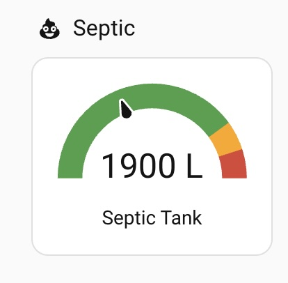

# Tank Fluid Level Measure

## Measure fluid level in a tank with a pressure sensor and Shelly Uni or Shelly Add On

## Overview

A project to measure fluid level in a tank suitable for rural water tanks, septic tanks etc. While there are many solutions to the problem of sensing water in a tank, 
this project uses a pressure sensor and Shelly for reasons discussed below. It can be standalone using the Shelly app or integrated into [home assistant](https://www.home-assistant.io/) for 
fancier displays and logic such as driving pumps. It requires power and relies on WiFi so probably not the right solution if the tank is more than say 50m from buildings.

Example home assistant dashboard:



## Features

- I believe this is more reliable and durable than alternatives
- Pretty easy (compared to say esp32/esphome/aduino style solutions)
- [Home Assistant](https://www.home-assistant.io/) integration allowing remote monitoring, automated transfer between tanks etc
- Not so much a feature as a warning: this can be quite an expensive solution, but if you want to drive a pump, nothing like as expensive as a pump
- In the case of septic tanks, knowing a pump out is or is not required without actually looking might save you money


## Hardware

- Pressure sensor such as [EARU](https://earu-electric.com) [0-10V pressure sensor](https://www.aliexpress.com/item/4000098291819.html)
- [Shelly Uni Plus](https://www.shelly.com/products/shelly-plus-uni) or [Shelly Add On](https://www.shelly.com/products/shelly-plus-add-on)
- Waterproof polycarbonate enclosure around 10cm x 8cm
- 12v DC power adapter
- Cable for 12v run between power supply and enclosure/Shelly. (For longer runs check the gauge is thick enough to avoid voltage drop) 
- 6 Wago 221 connectors or similar
- Barrel or similar connectors to attach power supply to 12v cable
- 2 or 3 [cable glands/grommets](https://www.aliexpress.com/item/1005001999417645.html)
- Optionally electrical conduit to protect cables in the ground or exposed to animals etc
- Optionally waterproof DS18B20 temperature sensor 

*Notes on hardware* 

When I first researched this project I saw a number of people had tried ultrasonic sensors and the like but I found [this video](https://www.youtube.com/watch?v=N90C9Xge8Z4) and went with it. Lars' video has most of what you need to know, here I try to spell out the other stuff I learnt or forgot when I added more tanks (mostly the wiring colours!).

A pressure sensor is expensive but basically just works while other methods don't seem to get rave reviews. These EARU sensors looked suitable to last in drinking water and grey water for decades though they might be overkill. I have no experience of other brand sensors which may be cheaper, I can update this if others have. Similarly you can probably replace the Shelly with alternatives that can read a ADV voltage. 

The range of the sensor you need is the depth of your tank.  

The length of the cable is the depth of your tank plus the distance to the location of your Shelly. So you need to decide if you are going to get power to
your tank and your tank has WiFi signal or if it is easier to run a longer sensor cable. For a price EARU will make cable lengths of 
25m, 50m (from memory maybe even 100m).  On Aliexpress you might have to message their support team to get a link for longer lengths. In most cases
running 12v power to the top of your tank is the obvious option. In my case for a septic tank buried in the ground there was no obvious place to secure 
the enclosure, wifi is weak and the Shelly might fry in the sun. Running a decent gauge power cable to the tank had a cost too.   

The EARU brand sensors have a 0-10V output option and support DC10-30V input power (you need to select 0-10V when purchasing). Because of this I went with a Shelly Uni rather than a 5/3.3v esp32.  I also figured 12v was better for longish distances to avoid voltage drop.  

You can use a Shelly Uni Plus or if you want to drive a pump, a Shelly Plus Add On with Shelly Plus 1.  The advantage of the Plus versions is that they support a *Voltmeter threshold* 
which in effect cuts out the noise from the sensor which otherwise may change voltage constantly.  Note that while you need mains power for your pump and can power a Shelly Plus 1 with mains power you still need to get 12v DC to the sensor.

## Tools
- Screwdriver probably Phillips to match polycarbonate enclosure
- Small flathead screwdriver for Shelly Uni
- A power drill and bits to make holes in the enclosure

##  Wiring diagram


## Software 

### Shelly

Using the Shelly App configure the ADC peripheral as normal.  I have not done much more with the Shelly because I use Home Assistant, but you could stop here and just use voltage readings and set up some actions to alert you to an empty tank or whatever if that is all you need.  

### Home Assistant Sensors

Integration with Home Assistant opens up many possibilities like:

- alerts when tanks are full or empty
- alerts for water leaks, taps left running etc
- visibility on water use over time, i.e. how long can we last during a drought, how much water do we catch during rain
- when combined with a mains relay (e.g. Shelly 1 Plus) and a pump:
  - automatically transfer water to another tank when full
  - scheduled transfers to feed animals etc
  - cancel scheduled transfers when empty

In order to display the tank level in litres you need a template sensor to convert the raw voltage from the Shelly as below. Initially you can just guess the voltage when full (7.84 in the example below) and then adjust when the tank is actually overflowing. You can just hardcode the volume in place of sensor.house_tank_volume if you prefer. 

```
template:
  - sensor:
    - unit_of_measurement: L
      default_entity_id: sensor.house_tank_volume
      name: House Tank Volume
      state: '  {{ ((3.14159 * radius **
        2 * height) * 1000) | round(0) }}'

  - sensor:
    - unique_id: c858678483
      default_entity_id: sensor.house_tank_litres
      name: House Tank Litres
      state: >
        
        
          
          {{ ((voltage / 7.84) * (states('sensor.house_tank_volume') | float(0))) | round(-1) }}
        
          0
        
```

I first used the v1 Shelly Uni which worked fine except that the voltage changed every few seconds.  I created statistics sensors to smooth the output.  I kept them when I upgraded to the Shelly Uni Plus so that I had long term statistics. 

```
sensor:
  - platform: statistics
    name: "Durras House Tank Median Litres"
    entity_id: sensor.durras_house_tank_litres
    state_characteristic: median
    max_age:
      minutes: 15
    keep_last_sample: true
    precision: 2
```

### Home Assistant Automations
My automations are basic, if tank full/empty send me a message type stuff. Your favourite AI can generate anything tricky.  Here is a simple example using a template condition to detect a tank loosing water.  You might be more interested if the *rate* of water loss is unexpected or you are loosing water when no one is home to use it etc. 

```
alias: Notify if tank loosing water
description: ''
triggers:
  - trigger: state
    entity_id:
      - sensor.abc_tank_litres
conditions:
  - condition: template
    value_template: |-
      
      
      {{ new < (old + 8) }}
actions:
  - action: notify.mobile_app_my_iphone
    metadata: {}
    data:
      message: ABC tank water level dropping
      title: HA
mode: single

```

## Step by Step Instructions

1. Purchase the hardware, noting points above on choosing/measuring cable lengths
2. Power up the shelly, connect to the AP and configure your wifi, update firmware etc as normal for Shelly. You might also want to set a static IP address for the Shelly in your router 
3. Before you climb up your tank, you might want to wire up the pressure sensor at this stage noting the wire colours in the diagram above and add the ADC peripheral to the Shelly in the App.  If you blow the sensor like a balloon you should see the voltage change
4. Install the grommets in the enclosure and feed the power and sensor cable in, wire the sensor, power and Uni as per the wiring diagram, if you can see varying voltage in the Shelly App you are ready to add to home assistant
5. Home assistant should auto-discover the Shelly, and create an ADC sensor
6. Create the template and statistics sensors in your configuration.yaml as above
7. Add to your dashboards and create automations as required
8. Just because you can you might add a temperature sensor to the Uni 

## Troubleshooting

The only problems I can recall were basic wiring issues which can be checked with a multimeter. If you have a loose connection you might trick the Shelly into resetting itself in which case it will revert to AP mode and need to be reconfigured. 


## License

MIT.
